# Capstone Project 2: Mars Sandwich Station
## 🪐 Mars Sandwich Station 🪐
My Capstone 2 Project is a Java based console line interface (CLI) 
point of sales application, a custom sandwich shop, that will allow 
users to fully customize their sandwich orders.

## Project Features
### Creating at the Sandwich Station

- Choose Bread Type
- Choose Sandwich Size
- Option for Toasted Sandwich (yes/no)
- Choose Meat(s) (extra option available)
- Choose Cheeses (extra option available)
- Choose Toppings
- Sandwich Price Calculation Provided

### Drinks
- Choose Drink Size (Small, Medium, Large)
- Choose Flavor of Drink
- Drink Price Calculation Provided

### Chips
- Choose your choice of Chips

### Signature Sandwich of the Day
- Reuben Signature Sandwich option
- Customer has ability to customize their signature sandwich

### Process Your Order
- User can add multiple sandwiches, drinks, or chips to order
- Price Calculations Provided
- Checkout with confirmation and cancellation option

### Receipt 
- Saves receipt to `src/main/resources/receipts/` folder as '.txt' file
- Filename includes date and timestamp (yyyyMMdd-HHmmss.txt)
- Displays : 
  - All Order Items
  - Item Summaries
  - Prices
  - Total Order Price

### Advanced OOP - Polymorphism
Mars Sandwich Station project uses **abstract class** :`OrderItem` with the child classes being `Sandwich`, `Drink`, and `Chips`.

### Project Structure 
UML Class Diagram : 
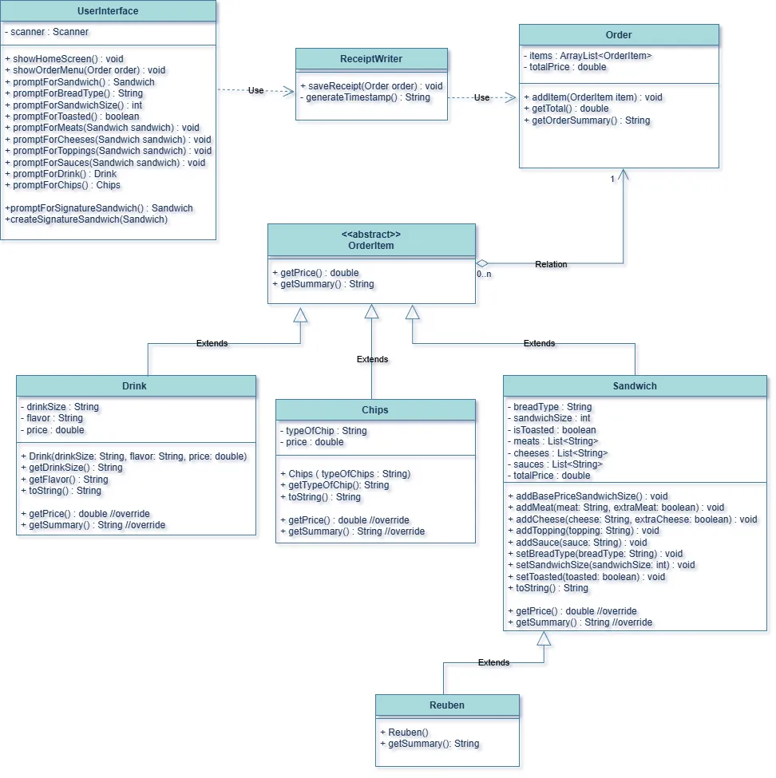

### Console Design
- Styled menu's with borders and symbols for a polished and easy to read
CLI.
- Displays messages with confirming successful actions to improve the user experience.

### Application Screens
A walkthrough of the screens in Mars Sandwich Station: 
- Home Screen Menu
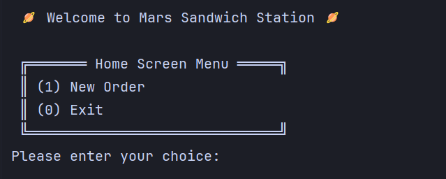
- When user chooses to create a new order, they are led to the Order Menu
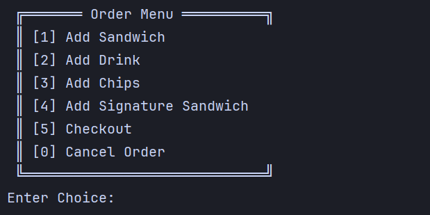
- Add Sandwich Prompts
  - Bread Type
    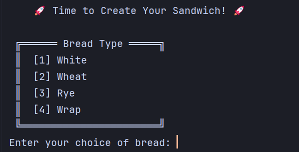
  - Sandwich Size
    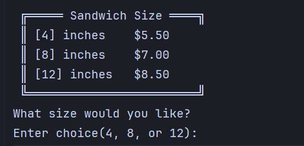
  - Toasted Option
    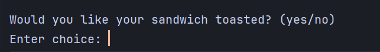
  - Meat Menu
    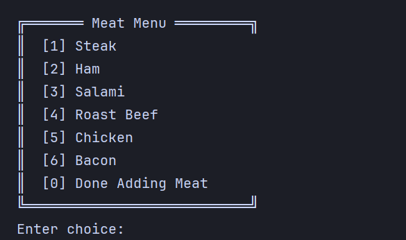
    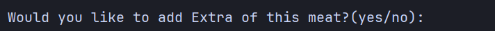
  - Cheese Menu
    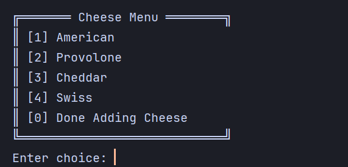
    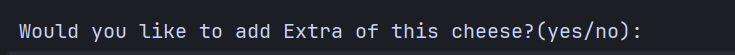
  - Toppings Menu
    
  - Sauces Menu
    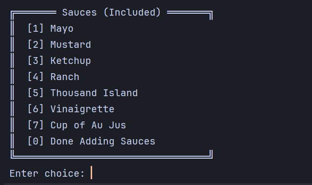
- Add Drink Prompts
  - Drink Size
    
  - Drink Flavor
    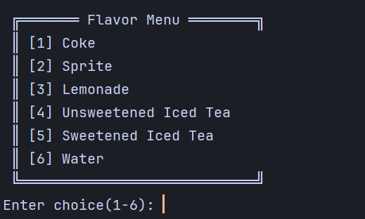
- Add Chips Menu
  
- Add Signature Sandwich of the Day
  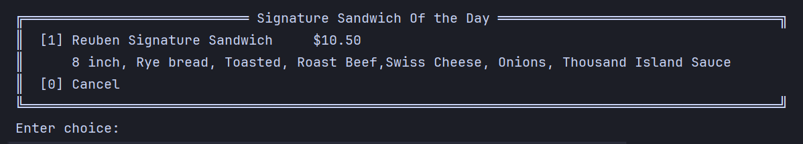

#### Resources
Emoji's throughout project are from [Emojicombos.com](https://emojicombos.com/sandwich)
